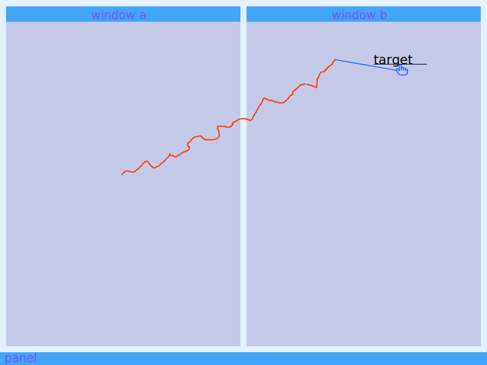

# Javelin

Touchpad on laptops with large screens has a problem: depending on cursor acceleration it's either too slow or imprecise. So, when it's too slow that requires several swipes to move cursor from one screen corner to another because finger moves outside the edge of touchpad, and when it's too fast that requires several swipes because cursor is hard to aim. With that touchpad usage becomes quite distracting and annoying. Let also add that in order to execute a precise cursor movement user must remember where cursor stays otherwise another swipe is required to find it.

I propose a solution which allows user to precisely aim cursor at the target with only two *short* swipes or even with just one in the best case. The first swipe moves cursor fast to "throw" it in an appropriate direction while the second moves it slowly to precisely complete the movement. Also, user don't need to remember where the cursor position stays because after a short timeout it moves to the center of active window, so the starting position of movement remains very predictable.

There are some sensible timeouts between motions that makes the cursor behavior intuitive and following DWIM motive [Do What I Mean].

It's perfect for:

- Tiling window managers because only one swipe is required to switch focus between windows.
- Reading documents and navigating the Web because it makes it easy to focus on elements like buttons.

Although it might be unsuitable for:
- Gaming, since with it users must keeps in sync with the current cursor mode which makes cursor movement erroneous.
- Drawing in image editors because of alternating cursor speed as well.

I call it *Javelin style motion* because cursor movement with it remembers projectile movement of famous Javelin anti-tank weapon. There's also some word-contrast with "arrow" style cursor movement which I like.

The current prototype is built in Rust language and depends on Sway window manager for Linux, implementing Wayland window protocol. Theoretically it would be possible to build something similar for X11 window managers as well as for other operating systems, however I'm concerned about resourse usage. The Rust programming language was choosen for speed but also because it's a great language!

Javelin depends on the following libraries:

- `clap` argument parser used for timeouts and device configuration
- `input` [libinput](https://freedesktop.org/wiki/Software/libinput/) bindings for Rust to read cursor movements
- `libc` required for `input` to initialize
- `signal-hook` to reset some Sway properties on termination signals
- `spin-sleep` used for precise timeouts in fast mode cursor animation
- `swayipc` to alter cursor speed and get active window position from Sway

## Installation

Currently the only way to install javelin is to clone this repository and run `cargo install --path .` or if you have Arch Linux then run `makepkg -ef` and install created package by `pacman`.
